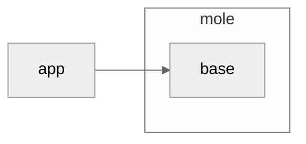

### Dependency Diagram

本项目模块图

```mermaid
%%{
  init: {
    'theme': 'neutral'
  }
}%%

graph LR

  subgraph mole
    base
  end
  app --> base

```
本项目只用作个人记录学习Android各类API的使用。
参考资料：
[Android官方文档](https://developer.android.com/develop/ui?hl=zh-cn)